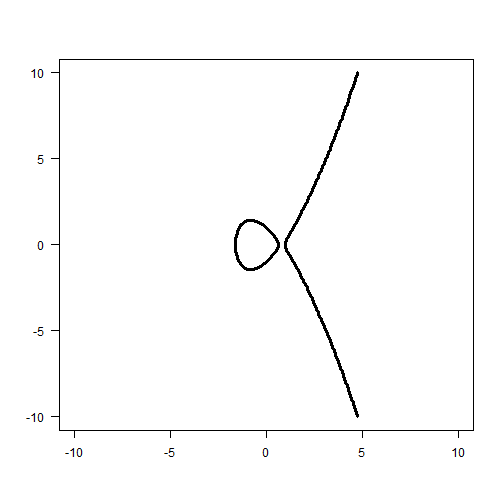

## What is an Elliptic Curve?
In mathematics, an elliptic curve (EC) is a smooth, projective algebraic curve of genus one, on which there is a specified point O. An elliptic curve is in fact an abelian variety - that is, it has a multiplication defined algebraically, with respect to which it is a (necessarily commutative) group - and O serves as the identity element. Often the curve itself, without O specified, is called an elliptic curve.

Any elliptic curve can be written as a plane algebraic curve defined by an equation of the form:

    y^2 = x^3 + ax + b


---
##Elliptic curves over the real numbers

Any elliptic curve can be written as a plane algebraic curve defined by an equation of the form:

    y^2 = x^3 + ax + b

which is non-singular; that is, its graph has no cusps or self-intersections. (When the characteristic of the coefficient field is equal to 2 or 3, the above equation is not quite general enough to comprise all non-singular cubic curves; see below for a more precise definition.) The point O is actually the "point at infinity" in the projective plane.

--- .class #id 
### Example

```r
f <- function(x,y) x^3 - y^2 - 2*x +1
x <- y <- seq(-10,10,length=100)
z <- outer(x,y,f)
contour(x=x, y=x, z=z,levels=0, las=1, drawlabels=FALSE, lwd=3)
```

 

---
## The group law
By adding a "point at infinity", we obtain the projective version of this curve. If P and Q are two points on the curve (i.e. their coordinates are solutions to the equation of the curve), then we can uniquely describe a third point which lies in the intersection of the curve with the line through P and Q. Usually there is a unique third point in the intersection (if the line is tangent to the curve at a point, then that point has to be counted twice; and if the line is parallel to the y-axis, we define the third point as the point "at infinity").

It is then possible to introduce a group operation, +, on the curve with the following properties: we consider the point at infinity to be 0, the identity of the group; and if a straight line intersects the curve at the points P, Q and R, then we require that P + Q + R = 0 in the group. One can check that this turns the curve into an abelian group, and thus into an abelian variety.

--- &radio
## Question 1

What is P + Q + 0 =?

1. P
2. _0_
3. Q
4. I don't know
